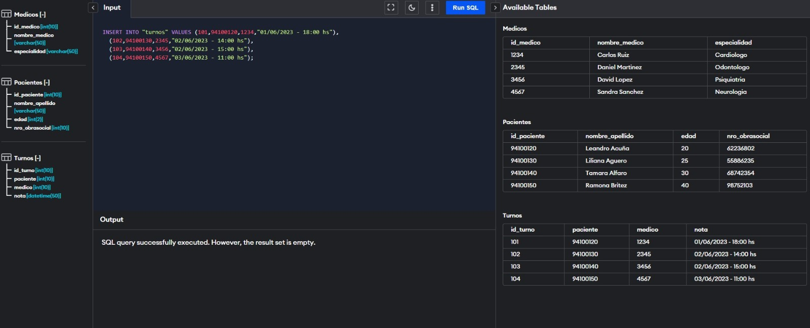

***Nuestro cliente, el Hospital Regional, me planteó la necesidad de crear una base de datos para poder registrar a los pacientes, turnos y cargar los datos de los médicos del establecimiento, para asi poder optimizar su trabajo diario.*** 

***Para cumplir con su requerimiento, se creó una BBDD que cumple con las necesidades del cliente y mejora la eficiencia, y organización del hospital.*** 

-------------------------------------------

**MODALIDAD DE TRABAJO**

>Metodologías Agiles Marco Scrum

>Jira Software

>2 Sprint

--------------------------------------------

***Creamos un Diagrama ERD con Pacientes, Turnos y Médicos.***

[.png)]()
---

***_Luego creamos la base de datos.***

---

***_Teniendo en cuenta las historias de usuario, trabajamos con una matriz en excel.***

[.png)]()
---

***_En Jira, nos dividimos las tareas y subimos las HU.***

---

***_Subimos nuestros casos de prueba en Jira.***

---

***_Procedimos a testear los test cases en la base de datos utilizando los siguientes Script.***

[.png)]()
---

***_Una vez que ejecutamos todo y no hubo bugs, pasamos todas las pruebas en Cycle Summary y cerramos el Sprint para darlo por terminado.***

[.png)]()
_____________________________________________________________________
***Espero les haya gustado el proyecto y gracias por la visita a mi perfil! :D***
